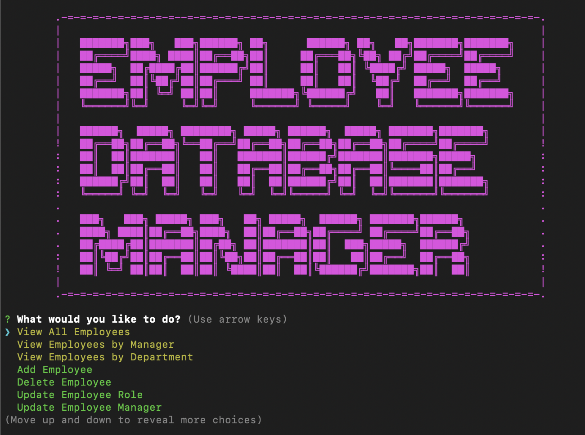

  # Employee Database Manager
  
  ## Description 
  This application was created with [MySQL](https://dev.mysql.com/doc/mysql-installation-excerpt/5.7/en/), [Node.js](https://nodejs.org/en), [mysql2](https://www.npmjs.com/package/mysql2) and [Inquirer](https://www.npmjs.com/package/inquirer). This application allows a user to manage a company's employee database.
  
  ## Table of Contents
  * [Technology Stack](#technology-stack)
  * [User Story](#user-story)
  * [Acceptance Criteria](#acceptance-criteria)
  * [Installation](#installation)
  * [Screenshot](#screenshot)
  * [Usage](#usage)
  * [License](#license)
  * [Contributors](#contributors)
  * [Outside Resources](#outside-resources)
  * [Questions](#questions)

  ## Technology Stack


  ## User Story
  ```md
  AS A business owner
  I WANT to be able to view and manage the departments, roles, and employees in my company
  SO THAT I can organize and plan my business
  ```

  ## Acceptance Criteria
  ```md
  GIVEN a command-line application that accepts user input
  WHEN I start the application
  THEN I am presented with the following options: view all  
  departments, view all roles, view all employees, add a  
  department, add a role, add an employee, and update an  
  employee role
  WHEN I choose to view all departments
  THEN I am presented with a formatted table showing department  
  names and department ids
  WHEN I choose to view all roles
  THEN I am presented with the job title, role id, the department  
  that role belongs to, and the salary for that role
  WHEN I choose to view all employees
  THEN I am presented with a formatted table showing employee data,  
  including employee ids, first names, last names, job titles,  
  departments, salaries, and managers that the employees report to
  WHEN I choose to add a department
  THEN I am prompted to enter the name of the department and that  
  department is added to the database
  WHEN I choose to add a role
  THEN I am prompted to enter the name, salary, and department for  
  the role and that role is added to the database
  WHEN I choose to add an employee
  THEN I am prompted to enter the employee’s first name, last name,  
  role, and manager, and that employee is added to the database
  WHEN I choose to update an employee role
  THEN I am prompted to select an employee to update and their new  
  role and this information is updated in the database
  ```
  
  ## Installation 
  * Clone the repository.
  ```
    git clone git@github.com:erin-m-keller/keller-employee-tracker.git
  ```

  * Install the dependencies.
    * Install [MySQL](https://dev.mysql.com/doc/mysql-installation-excerpt/5.7/en/)

  Start the MySQL server in the terminal (ensure you are in the root directory of the project)

  ``` bash
    - mysql -u root -p 
  ```

  Enter the password
  ``` bash
    password_goes_here
  ```

  Once MySQL server has started, create the database

  ``` bash
    SOURCE schema.sql 
  ```

  Seed the database with data
  ``` bash
    SOURCE seed.sql
  ```

  Exit the MySQL server
  ``` bash
    exit OR quit
  ```

  Create an .env file in the root directory and set your local MySQL server username and password
  > Don't worry, it will only be saved to your local machine. The .env file is in .gitignore
  ``` bash
    DB_USER = "your_username_here"
    DB_PASSWORD = "your_password_here"
  ```
  Start the application
   ``` bash
    npm start
  ```
  > You'll be presented with the database interface

  ## Screenshot

  
  
  ## Usage
  
  https://doc-14-00-docs.googleusercontent.com/docs/securesc/hfmsvnnac5bqd0c301rec52shi25ro6u/kjrrbe9trmeq1j83u2bbpt9oc6moub3n/1682362275000/18118564744627136421/18118564744627136421/1iELxbAFZ1_PYDwMMTFaTdvwde3DP2lkQ?ax=ALy03A76Ls1J3GnkMWzvfzUv7r6UamBrC0Aq2TPpmyLqk0be5e8FJ5edRYu1BEDRWJB-7PAToDdLyyazMn8pIpyaWG0Ug0Fy9DY4FEDzNYBXnafoNft2_eic3RQVhbgW4AVXbCjvINM4R4H08e0o7VInm155glxLxffdk8xPHyoXEQA6wQqKs8B31wBzScBrt8G9__Ek1rHi_rK9_uzJCMQWSCFUuaYXwiDVxO9MVOTgV10_hwWWyBd2MXzAjIp2ub5Is4F0RL_4rhefrdofsCvNihg8O4MWCPTgiKeRwOUAPv7TI49tfpxPKLvSBnolkJ-P_ulr0lUVLzZUsiHQpWrjLIuMSoSFpQeBq7CQNQY5eKcx-bVZH9C00C8uc_3MEM6SQaOgskG_1r5jbrJN4e0XNixp4lT4u2Mbad-3tQ1a8I5gU0a-mGXmHUdUZENroIvL3Fi_CEALHtdt6mBT-o_jDc2vQKER5BGidL7CbILaKHsFgr4JNTEixPFJgRV2du0jq6fQX4-dzC1pSuxSl5RDkOO85GNG71_seY-spst9AwdBXvkVDbHBPFM5NYngkEIlbn9ubauyj05xkayGdQMrdk8GcKt_qWAmb45s58VSOgnHGa-qNJzltCHmqzWq2m8ql1sw-zWrWw4MkKnX0uDTClw0xVs1sLL6KoEcyzj2s-C0Whe7SUs0TCqE7yMz3A7F2bnEZnP5v_WX7xqsmVk1oPfDeagHUw2Vh1x6pj2ybsi52laUJlYQcdEUNCm0GcvtIR2niCwX2eOi4V8w0kbxTxn_XRim1soE7eMWQc3fLEZv0QhoLp7Y7EBttNYbYpci7idIB563eBjjDocsRd1EsRMHHnya3zQbXum45rWtlhPITETbvDz9zDavhZLp7LkrZg&uuid=3379da43-ed7e-4a42-9d1d-77070d0e0a5c&authuser=0&nonce=t8o23kul84b70&user=18118564744627136421&hash=4rnqp1fm83rvej83butlouf4rgciiv9f

  > Click play to watch the video. Enjoy the music!
  
  ## License 
  [](https://lbesson.mit-license.org/)
  
  ## Contributors 
  [Erin Keller](https://github.com/erin-m-keller)

  ## Outside Resources

  * [ChatGPT](https://openai.com/blog/chatgpt): Used ChatGPT to generate the dummy data for [seed.sql](./seed.sql) and also the regex patterns in my class files.
  
  ## Questions
  If you have any questions about this project, please contact me directly at [aestheticartist@gmail.com](aestheticartist@gmail.com).  
  You can view more of my projects [here](https://github.com/erin-m-keller).
  
